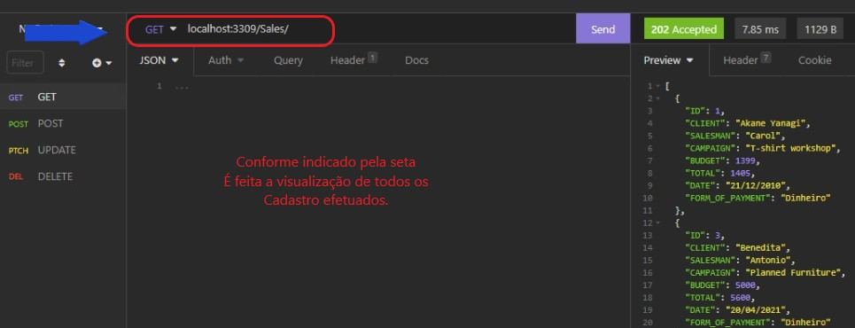
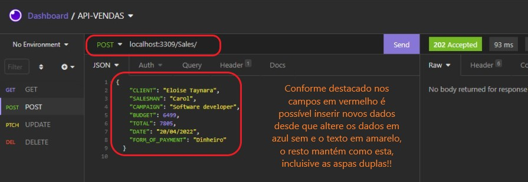
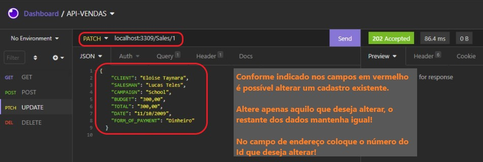
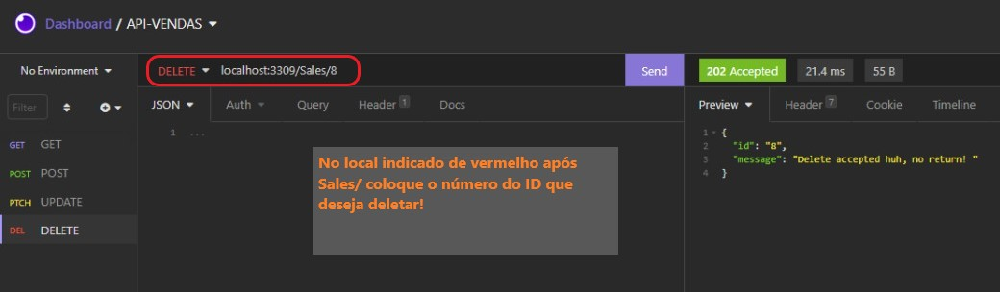

<h1 align="center">API_publicity_agency</h1>
<br>

### Desenvolvimento de API Rest
_Ambiente NodeJS utilizando framework web_
<br>

### Descrição
_O objetivo do estudo, foi criar uma API usando banco de dados não relacional SQLite3, seguindo o padrão de organização MVC, com possibilidade de aplicações Web, como softwares e sites, consistindo em um protocolo sobre a Arquitetura da Informação._
<br>

### Desenvolvimento de API Rest
Ambiente NodeJS utilizando framework web
<br>

### Descrição
API construída como objeto de estudo, usando banco de dados não relacional SQLite3, seguindo o padrão de organização MVC e hospedagem feita na plataforma cloud Heroku , Uma API tem possibilidade de aplicações Web, como softwares e sites, consistindo em um protocolo sobre a Arquitetura da Informação. 
<br>

### Ferramentas utilizadas
JavaScript
NodeJS 16.13.1 LTS
Framework Express
SQLite
<br>

### Todas a dependências necessárias, além do comando <b>npm install --save</b> feito no terminal
```
"dependencies": {
    "dotenv": "^10.0.0",
    "express": "^4.17.1",
    "nodemon": "^1.10.2",
    "sqlite": "^4.0.23",
    "sqlite3": "^5.0.2"
  }
  ```
  Este trecho pode ser encontrado dentro do arquivo <b>packge.json</b>
  <br>
### OBS para rodar a API
Basta dar o comando <b>npm start</b> ou <b>npm run dev</b> no terminal
<br>

<br>
 <ul><b>CRUD</b>
 <br>
  Os verbos HTTP vão indicar qual ação está sendo requisitada pelo consumidor do serviço.                          
 <li>Create</li>                    
 <li>Read</li>                        
 <li>Update</li>                     
 <li>Delete</li>         
 </u>
 <br>

### Exemplos de como utilizar as rotas
<b>GET</b>
 <br>
    
      <br>
Ainda em GET se após <b>Sales/</b>  mais o <b>ID</b> de sua preferencia
é possível ver o cadastro especificado.
<br>

<b>POST</b>
 <br>
   
     <br>                                   
<b>UPDATE</b>
 <br>
   
     <br>                          
<b>DELETE</b>
  <br>
                                 
